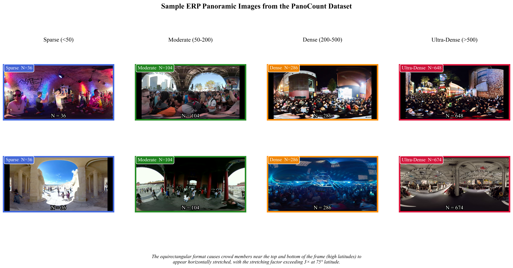
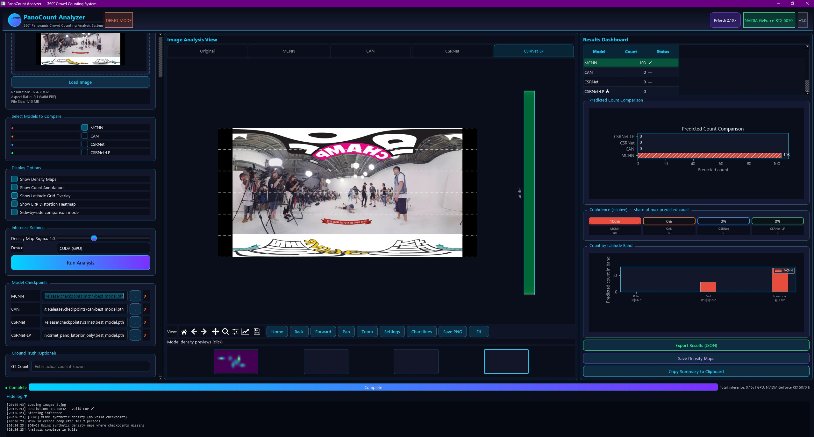

[]()
[]()

# PanoCount: Latitude-Aware Crowd Counting in 360° Panoramic Imagery

Official implementation of **"Beyond Perspective: Latitude-Aware Crowd Counting in Equirectangular Panoramic Imagery"**.

## Overview
This repository contains:
- CSRNet-LP model implementation (latitude prior + circular padding)
- MCNN, CAN, CSRNet baseline implementations
- PanoCount dataset loader and split utilities
- Interactive GUI for inference on 360° images
- Pre-trained model checkpoints

## Sample Results

### PanoCount Sample Images


*Figure 1: Sample outputs from PanoCount360 showing crowd counting results*

### GUI Tool Interface


*Figure 2: Graphical User Interface tool for counting and visualization*

## Dataset Access Request

The **PanoCount** dataset will be officially released upon paper acceptance. To ensure responsible use and manage access during the review/pre-release phase, we provide a formal request process.

If you need **early access for academic review, reproducibility, or research collaboration**, please follow the procedure below:

### 📝 How to Request Access

1. **Fill out the request form** (or use the template below):
   - **Your Name & Affiliation**:
   - **Official Email** (institutional email preferred):
   - **Purpose of Use** (e.g., reproducibility, method comparison, journal review, educational):
   - **Intended Publication** (if any):
   - **Agreement to Non-Commercial Academic Use Only** (Yes/No):

2. **Send your request** to the corresponding authors at: **arbi@mail.ustc.edu.cn**.

3. **Subject line format**: `PanoCount Dataset Access Request - [Your Last Name]`

### ⏳ What to Expect

- Requests are typically processed within **5-7 business days**.
- Access will be granted via a **secure, private download link** (e.g., Google Drive, Dropbox, or institutional server).
- You will be asked to agree to a simple **Dataset License Agreement** (non-commercial, academic use only, no redistribution).

> **Note for Reviewers**: If you are reviewing our paper, please mention "Reviewer Access" in the subject line to prioritize your request.

---

*We plan to release the full dataset publicly after the peer-review process is complete. Thank you for your interest in PanoCount!*

## Checkpoints
Pre-trained weights are provided in `checkpoints/`. Due to GitHub file size limits, download them from [release page](../../releases).

## Installation
```bash
conda env create -f environment.yml
conda activate panocount
pip install -r requirements.txt
```

## Training
```bash
python main.py --model csrnet_pano --config configs/csrnet_pano.yaml
```

## Evaluation
```bash
python main.py --model csrnet_pano --eval --checkpoint checkpoints/csrnet_lp_best.pth
```

## GUI
```bash
python gui/app.py
```

---

# PanoCrowdCount

Small starter project for panoramic crowd counting.

What I added for now:
- `test_gpu.py` — a small Python script to check CUDA availability and run a tiny GPU benchmark (matrix multiply + allocation). Useful to confirm your RTX GPU is seen by PyTorch.

Quick start (Windows PowerShell):

1. Create a virtual environment (recommended):

```powershell
python -m venv .venv; .\.venv\Scripts\Activate.ps1
```

2. Install the dependencies (example):

```powershell
pip install -r requirements.txt
```

3. Run the GPU test:

```powershell
python .\scripts\test_gpu.py
```

## PanoCount Analyzer (GUI)

Desktop app for ERP visualization and multi-model comparison (MCNN, CAN, CSRNet, CSRNet-LP).

```powershell
pip install -r requirements.txt
pip install -r requirements-gui.txt
python .\main.py
```

See [README-analyzer.md](README-analyzer.md) for details. Use a working PyTorch install (e.g. conda env `seg` on Windows if the venv `torch` DLL fails to load).

Notes:
- If `torch` isn't installed with a CUDA-enabled build compatible with your drivers, the script will tell you and exit. Install a matching PyTorch wheel from https://pytorch.org/get-started/locally/.
- The script prints the device name and memory; if it shows your RTX 5070Ti (or similar), your GPU is visible to PyTorch.

## Citation

If you use PanoCount or CSRNet-LP in your research, please cite our paper:

```bibtex
@article{arbi2025panocount,
  title     = {Beyond Perspective: Latitude-Aware Crowd Counting in Equirectangular Panoramic Imagery},
  author    = {Arbi, Ghulam and Zhang, Lu and Zhang, Yanyong},
  journal   = {Information Sciences},
  year      = {2025},
  note      = {Under review}
}
```

## License

This code is released under the [MIT License](LICENSE).  
The PanoCount dataset will be released under [CC BY-NC 4.0](https://creativecommons.org/licenses/by-nc/4.0/) upon paper acceptance.
